# Verteilte Anwendung

## Entwicklungsumgebung Eclipse Java Web Tools Platform 
[Entwicklungsumgebung Java Web Tools](https://www.eclipse.org/webtools/) Downloaden.

> Im Terminal überprüfen ob Java JDK installiert ist.
```Terminal
    java -version
```
> Falls Java JDK noch nicht installiert ist <br>
> [Java JDK](https://www.oracle.com/technetwork/java/javase/downloads/index.html)

<hr>

### Eclipse IDE for Enterprise Java Developers installieren

1. Eclipse öffnen
2. Eclipse in Applications Ordner verschieben
3. Eclipse in Applications Ordner (Finder -> Programme) suchen und öffnen.
4. Beim ersten Starten wird über ein Dialog Fenster abgefragt,
> „Eclipse“ ist eine aus dem Internet geladene App. Möchtest du sie wirklich öffnen?
und auf diesem Dialogfenster auf öffnen klicken. (Falls dieses Dialogfenster nicht erscheint und das Programm nicht startet, siehe Punkt 4.1.)

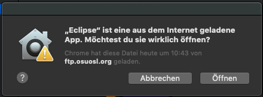

4.1. Systemeinstellung öffnen -> Sicherheit -> Allgemein -> Apps - Downlaod erlauben von -> Und dort dann zulassen. 

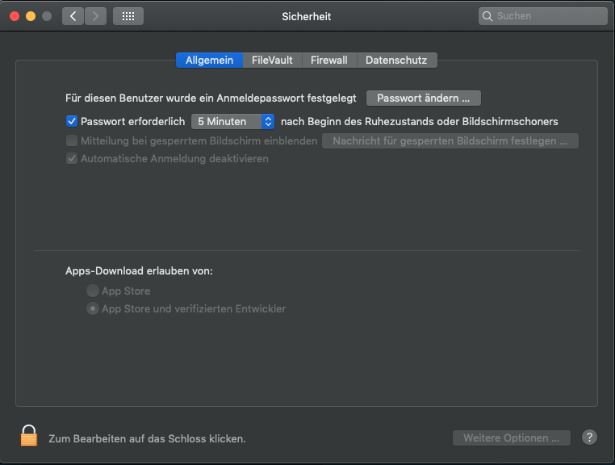

1. Workspace auswählen. Danach sollte dieser Startdialog kommen. Darauf ist zu achten das Eclipse Java EE IDE for Web Developers im Header steht.

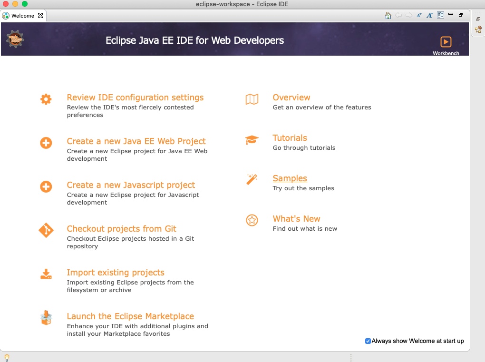

<hr>

## Installierung von Tomcat Server 

[Download Tomcat](http://tomcat.apache.org/download-90.cgi) -> Die Core Datei [zip(pgp, sha512)](https://www-eu.apache.org/dist/tomcat/tomcat-9/v9.0.16/bin/apache-tomcat-9.0.16.zip)
> Speichere den Download von Tomcat am besten in deinem Download Ordner ab.

1. Tomcat zip File in Downloads entpacken. (Nach der Installation von Tomcat kann man diese Zip Datei wieder löschen.)
2. Terminal öffnen.
3. Nun wird die entpackte Datei verschoben. <br> 
```sudo mkdir -p /usr/local ``` <br>
```sudo mv ~/Downloads/apache-tomcat-9.0.16 /usr/local```<br>
! Bitte beachten welche Version runtergeladen wurde. Die Versionsnummer gegebenfalls Austauschen (tomcat-9.0.16).

4. Um später einfacher eine neuere Version zu Integrieren ersetzen wir den Tomcat Ordner in /Library/Tomcat durch einen symbolic Link aus unserem usr/local ordner. <br>
```sudo rm -f /Library/Tomcat```<br>
```sudo ln -s /usr/local/apache-tomcat-9.0.16 /Library/Tomcat```<br>

1. Nun ändern wir noch die Rechte des Ordners.(Usernamen ohne Spitze klammern.) <br>
```sudo chown -R <your_username> /Library/Tomcat```<br>
> ```sudo chown -R benediktgrether /Library/Tomcat ```<br>

6. Alle Script ausführbar machen.<br>
```sudo chmod +x /Library/Tomcat/bin/*.sh``` <br>

7. Server starten<br>
```/Library/Tomcat/bin/startup.sh```<br>

8. Server stoppen<br>
```/Library/Tomcat/bin/shutdown.sh```

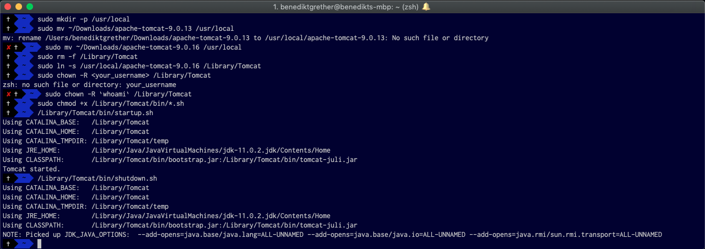

<hr>

## Tomcat mit Eclipse IDE for Enterprise Java Developers verbinden

1. Eclipse öffnen.
2. Willkommens Fenster schließen.
3. Unten in der Leiste Server auswählen
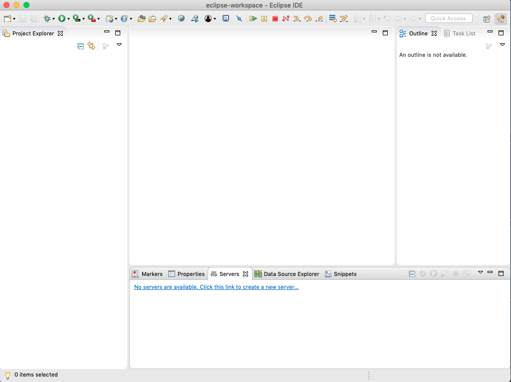<br><br>
4. Neuen Server erstellen
5. Den Apache Dropdown Ordner auswählen
6. Tomcat v9.0 Server auswählen -> Next
7. Bei Tomcat installation directory auf Browse klicken
8. Nun im Dropdown Menü Festplatte auswählen.
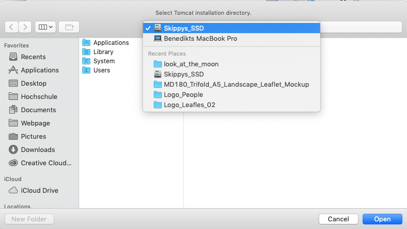<br><br>
9. Nun Library -> Tomcat auswählen und auf Open clicken.
10. Finsihed und dann Server starten klicken.
11. Wenn alles funktioniert, steht in der Leiste Tomact v9.0 Server at Localhost[Started, Synchronized].
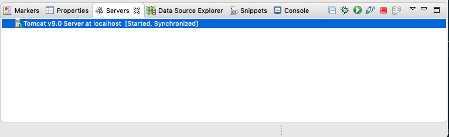<br><br>

<hr>

## Installation von MySQL

[MYSQL](https://dev.mysql.com/downloads/mysql/) herunterladen.

1. Am Ende der Installation wird gefordert das man ein Passwort erstellt. Dort wählt man nun Use Legacy Password Encryption <br>
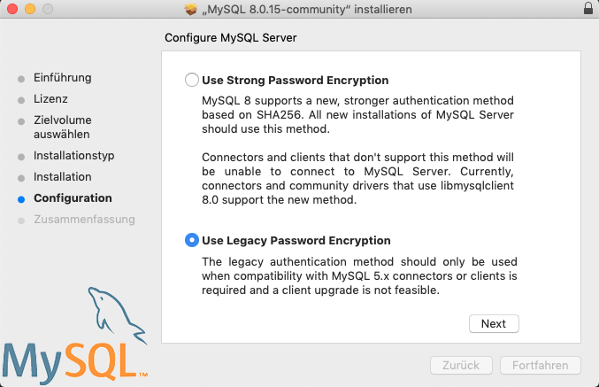<br><br>

2. Nun ein Passwort wählen und auf Finish klicken und den MacBook neustarten.
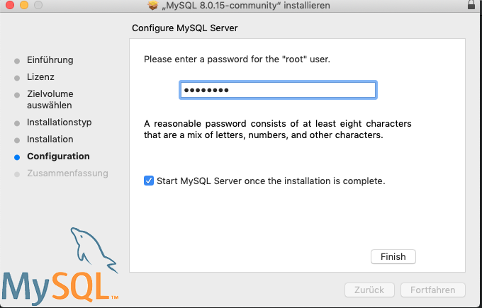<br><br>

3. Nun in den Systemeinstellungen überprüfen ob MySQL installiert ist, und überprüfen ob MySQL läuft.
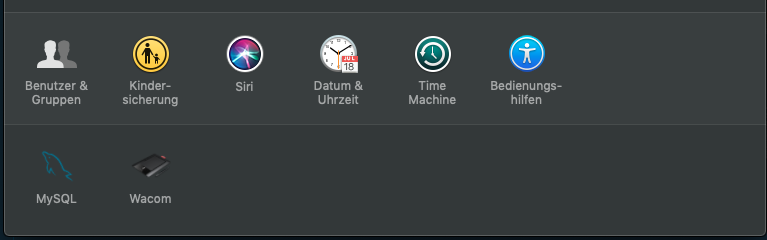<br><br>
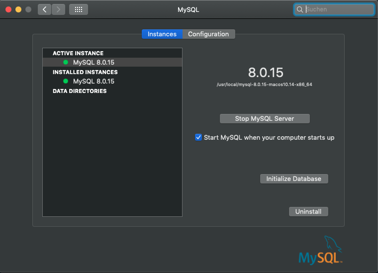<br><br>

<hr>

## Installation von Sequel Pro

Sequel Pro über Homebrew installieren. 
1. Überprüfen ob Homebrew installiert ist. Dazu geben wir im Terminal<br>
```which brew``` <br>
ein 

> Homebrew ist installiert -> /usr/local/bin/brew -> weiter mit Punkt 3 <br>
> Homebrew ist nicht installiert -> brew not found -> weiter mit Punkt 2 <br>

2. Installieren von Homebrew falls es noch nicht vorhanden ist.<br>
[Homebrew Documentation](https://brew.sh/index_de)<br>
Im Terminal folgenden Befehl eingeben <br>
``` /usr/bin/ruby -e "$(curl -fsSL https://raw.githubusercontent.com/Homebrew/install/master/install)"```

3. Nun installieren wir Sequel Pro über Homebrew (Es kann sein das erst ein Update von Homebrew durchführt.) <br>
```brew cask install homebrew/cask-versions/sequel-pro-nightly```

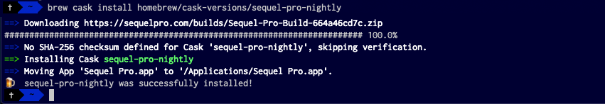<br><br>

4. Sequel Pro starten.
5. Im Connectionfenster nun TCP/IP auswählen und Daten eingeben.
   > Host: 127.0.0.1 <br>
   > Username: root <br>
   > Password: ****** <br>
   > Database und Port sind optional falls ein anderer Port wie 3306 in verwendung ist.<br>

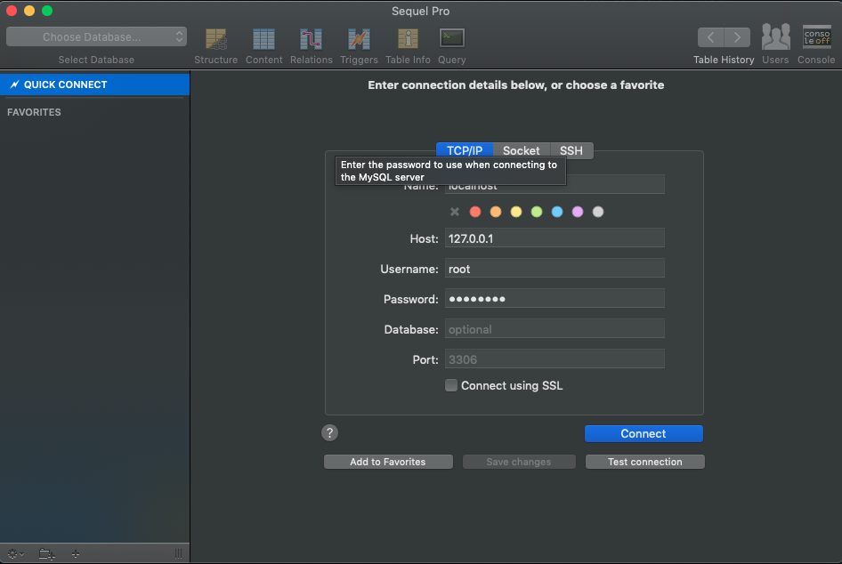<br><br>
6. Connect
   
7. Nun wird eine neue Datenbank angelegt. <br>
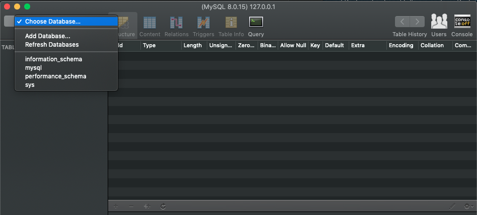<br><br>

<hr>

## Datenbank mit Eclipse IDE for Enterprise Java Developers verbinden

1. Nun laden wir ein MySQL Package für Java herunter. <br>
[MySQL Package](https://www.mysql.com/de/products/connector/) <br> und wählen da JDBC Driver for MySQL (Connector/J) aus <br>
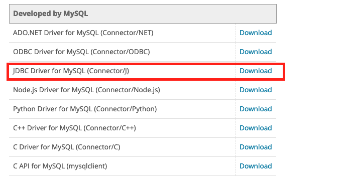<br><br>
> Achtet beim Downloaden auf eure Aktuelle MySQL Version damit ihr den richtigen Connector auswählt.
1. Auf der Webseite wählen wir nun Platform Indepentent aus und Laden die Zip oder .tar Datei herunter.
2. Nun kopieren wir die Datei <br>
```mysql-connector-java-8.0.15.jar``` <br>
in den Ordner <br> ```Library/Tomact/lib/``` <br>
hinein.
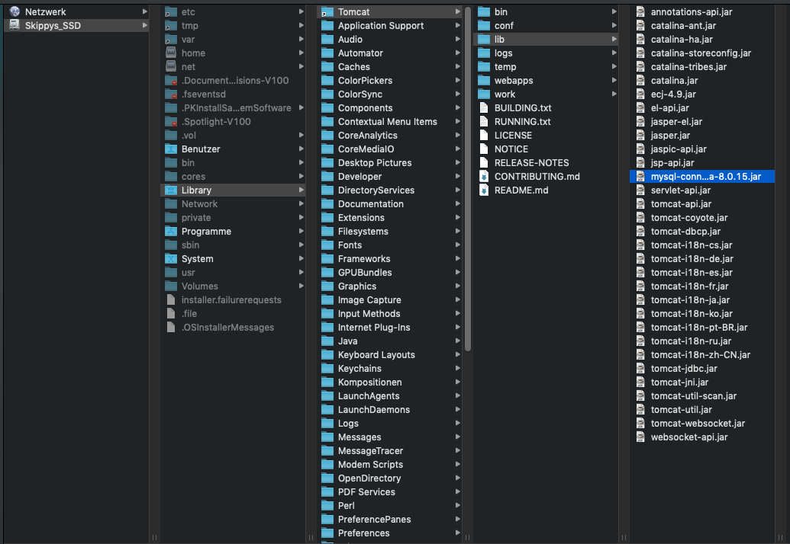<br><br>
3. In Eclipse gehen wir auf den Reiter auf Data Source Explore und Database Connections mit rechtsklick und auf New
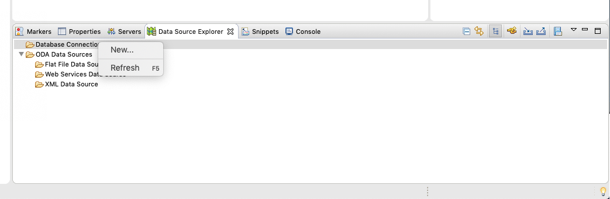<br><br>
4. Nun Generic JDBC auswählen und auf Next <br>
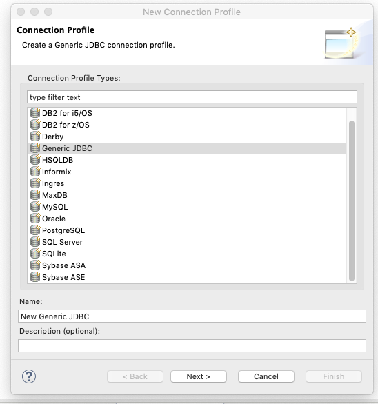<br><br>
5. Nun werden wir einen neuen Driver hinzufügen in dem auf JAR List klicken und dann auf ADD JAR/Zip. Nun gehen wir wieder in den Library/Tomcat/lib/ Ordner und wählen mysql-connector-java-xxx.jar aus.
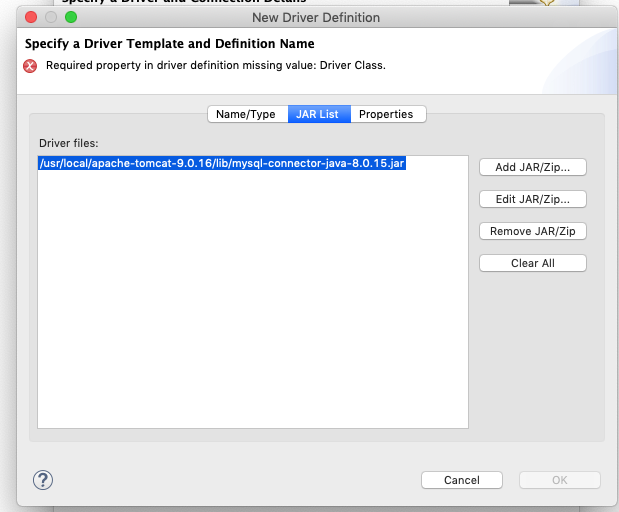<br><br> 
6. Danach Klicken wir auf Properties (es kann sein das Propertie nicht beim ersten mal Auftaucht. Bitte dann bei Driver files den Connector auswählen -> oder Edit und dann auf Abbrechen klicken und zurück in den Properties Reiter wieder wechseln bis diese Abbildung dargestellt wird).
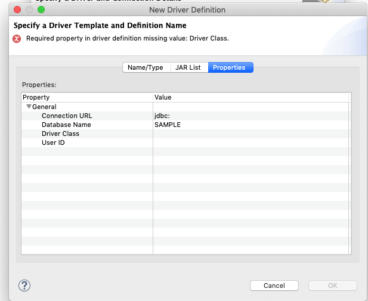<br><br> 
7. Nun geben wir diese Values ein.
> Connection URL : jdbc:mysql://127.0.0.1:3306/Name-der-Datenbank <br>
> Database Name : "Name wie die Datenbank heißt"<br>
> Driver Class : -> Hier nun auf die ... Punkte klicken.<br>
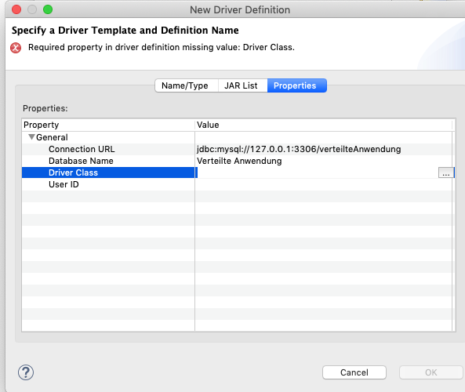<br><br> 
Hier wählen wir nun den untersten Database Driver aus 
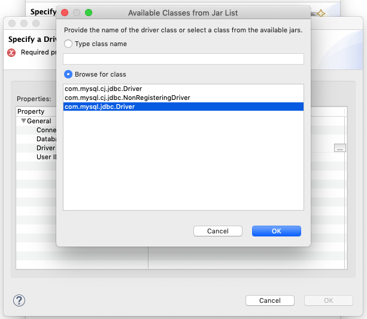<br><br> 
8. Nun auf Ok klicken und im nächsten Fenster geben wir nun folgende Sachen ein.
> Database: "Name der Datenbank" <br>
> URL:  dbc:mysql://127.0.0.1:3306/Name-der-Datenbank <br>
> User name: root <br>
> Password: ******* <br>

Dann die Checkbox Save Passwort auswählen und danach auf Test Connection.
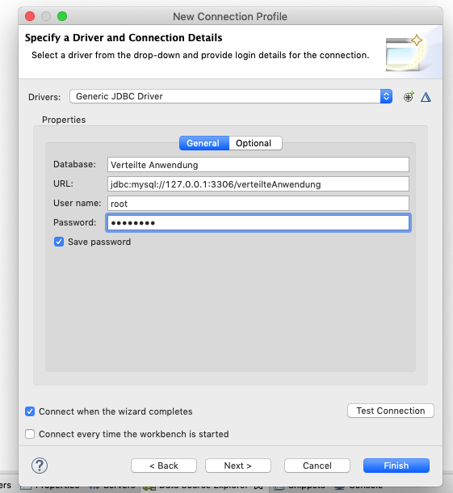<br><br> 
9. Bei erfolgreichem Test kommt dieser Dialog
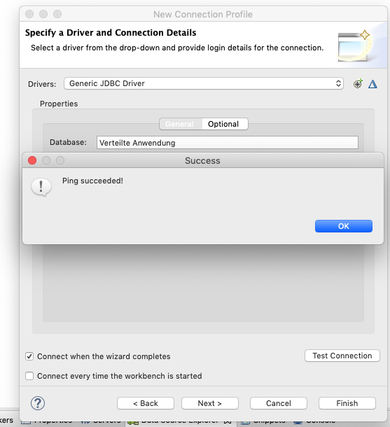<br><br> 
10. Nun auf Finish klicken und die Datenbank wird nun im Data Source Explorer angezeigt.
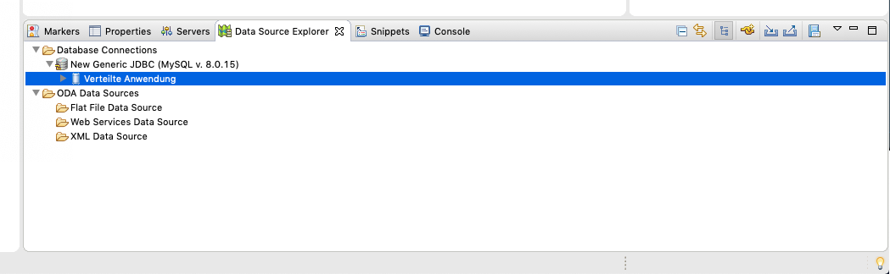<br><br> 